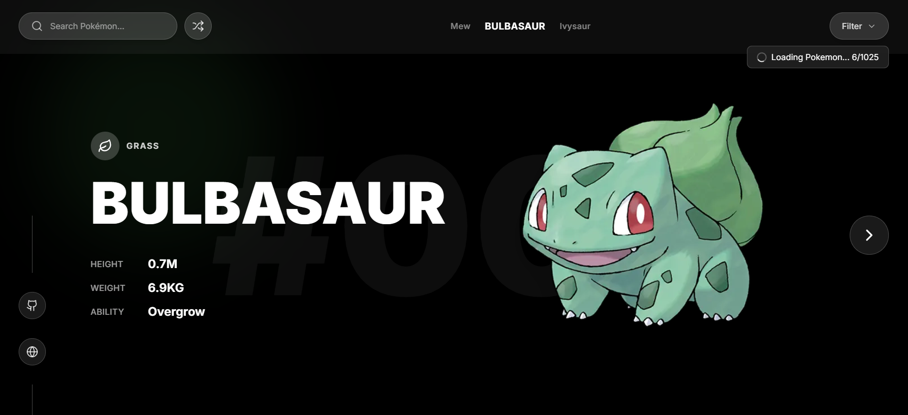
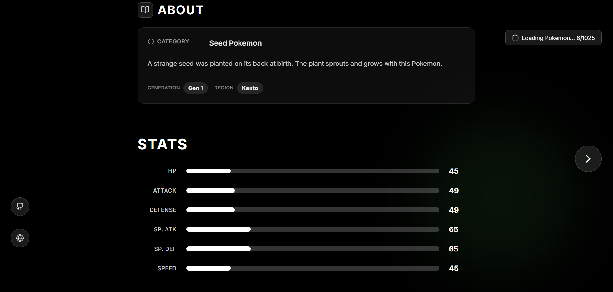
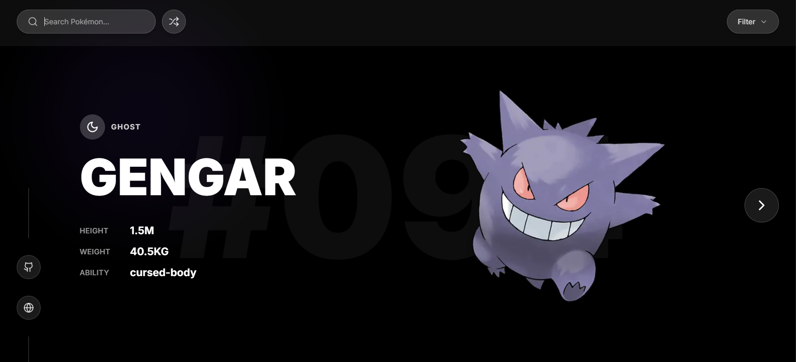
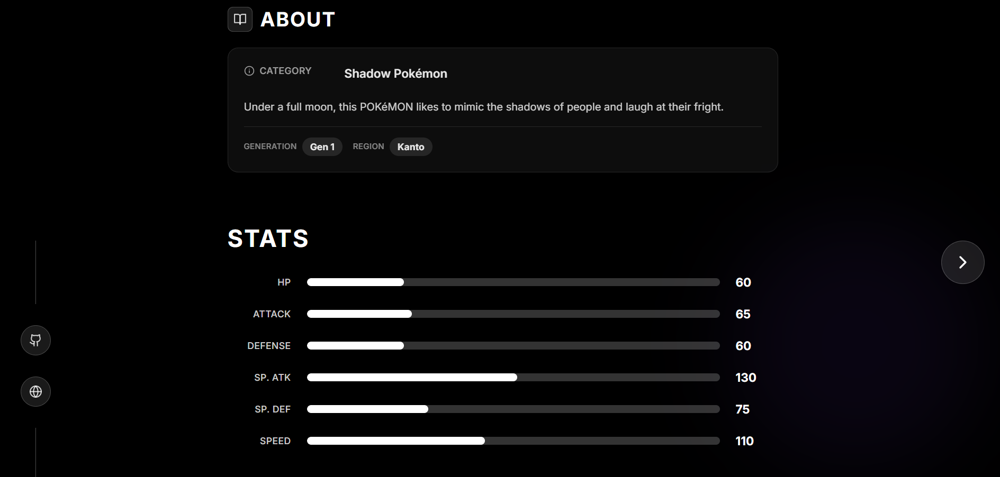

<div align="center">

# 🎮 Pokémon Dashboard (Pokédex)

A modern, highly aesthetic, and responsive Pokémon Details Dashboard built with React, Next.js, Tailwind CSS, and Framer Motion. Features a clean, minimalist design with dynamic color theming based on Pokémon types.

</div>

<p align="center">
  <a href="https://github.com/Emp1500/pokemon/stargazers">
    
  </a>
  <a href="https://github.com/Emp1500/pokemon/network/members">
    
  </a>
  <a href="https://github.com/Emp1500/pokemon/issues">
    
  </a>
  <a href="./LICENSE">
    
  </a>
</p>

<p align="center">
  
  
  
  
</p>

<div align="center">

[Features](#-features) • [Demo](#-demo) • [Installation](#-installation)

</div>

---

## ✨ Features

### Current Features
- 🎨 **Dynamic Theming**: Background colors and gradients change based on Pokémon type
- ✨ **Smooth Animations**: Framer Motion animations for page transitions and UI elements
- 🔍 **Glassmorphism UI**: Modern glass-effect components with backdrop blur
- 📱 **Responsive Design**: Fully responsive layout that works on all devices
- 🔄 **Interactive Navigation**: Browse through Pokémon with smooth transitions
- 📊 **Animated Stats**: Progress bars with animated fill effects
- 🎭 **Floating Pokémon**: Subtle floating animation for Pokémon images
- 🎲 **Random Shuffle**: Discover random Pokémon with one click


---

## 🚀 Demo

<div align="center">
    
    <br/>
    <br/>
    
    <br/>
    <br/>
    
    <br/>
    <br/>
    
</div>


---

## 🛠️ Tech Stack

| Technology | Purpose |
|------------|---------|
| [Next.js 14](https://nextjs.org/) | React framework with App Router |
| [React 18](https://react.dev/) | UI library |
| [TypeScript](https://www.typescriptlang.org/) | Type-safe JavaScript |
| [Tailwind CSS](https://tailwindcss.com/) | Utility-first CSS framework |
| [Framer Motion](https://www.framer.com/motion/) | Animation library |
| [Lucide React](https://lucide.dev/) | Icon library |
| [PokeAPI](https://pokeapi.co/) | Pokémon data source |

---

## 📦 Installation

### Prerequisites

- Node.js 18+ installed
- npm, yarn, or pnpm package manager

### Quick Start

1. **Clone the repository**
```bash
git clone https://github.com/Emp1500/Pokemon.git
cd Pokemon
```

2. **Install dependencies**
```bash
npm install
# or
yarn install
# or
pnpm install
```

3. **Run the development server**
```bash
npm run dev
# or
yarn dev
# or
pnpm dev
```

4. **Open your browser**

Navigate to [http://localhost:3000](http://localhost:3000)

### Build for Production

```bash
npm run build
npm start
```


---

## 🎨 Customization

### Adding New Pokémon

Edit `lib/mockData.ts`:

```typescript
export const mockPokemonList: Pokemon[] = [
  {
    id: 1,
    name: 'Bulbasaur',
    type: 'grass',
    types: ['grass', 'poison'],
    height: 0.7,
    weight: 6.9,
    abilities: ['Overgrow', 'Chlorophyll'],
    stats: {
      hp: 45,
      attack: 49,
      defense: 49,
      spAtk: 65,
      spDef: 65,
      speed: 45,
    },
    imageUrl: 'https://...',
  },
  // Add more Pokémon here
];
```

### Customizing Type Colors

Modify `lib/colors.ts`:

```typescript
export const TYPE_COLORS: Record<PokemonType, { bg: string; gradient: string }> = {
  grass: {
    bg: 'rgb(76, 175, 80)',
    gradient: 'linear-gradient(135deg, rgb(76, 175, 80) 0%, rgb(56, 142, 60) 100%)',
  },
  // ... customize other types
};
```

### Tailwind Configuration

Extend Tailwind in `tailwind.config.ts`:

```typescript
module.exports = {
  theme: {
    extend: {
      colors: {
        // Add custom colors
      },
      animation: {
        // Add custom animations
      },
    },
  },
};
```


---

## Disclaimer

This is a fan-made project and is not affiliated with Nintendo or The Pokémon Company. All Pokémon-related content, including names, images, and data, is the property of Nintendo and The Pokémon Company.

---

## How to Get Help

If you have any questions or need help with the project, please [open an issue](https://github.com/Emp1500/pokemon/issues).

---

## 🤝 Contributing

Contributions are welcome! Please read [CONTRIBUTING.md](./CONTRIBUTING.md) for details on our code of conduct and the process for submitting pull requests.

### Development Workflow

1. Fork the repository
2. Create your feature branch (`git checkout -b feature/AmazingFeature`)
3. Commit your changes (`git commit -m 'Add some AmazingFeature'`)
4. Push to the branch (`git push origin feature/AmazingFeature`)
5. Open a Pull Request

---

## 🐛 Issues

Found a bug? Have a feature request? Please [open an issue](https://github.com/Emp1500/pokemon/issues).

---

## 📄 License

This project is licensed under the MIT License - see the [LICENSE](./LICENSE) file for details.

---

## 🙏 Credits & Acknowledgments

- **Pokémon Data**: [PokeAPI](https://pokeapi.co/) - RESTful Pokémon API
- **Framework**: [Next.js](https://nextjs.org/) by Vercel
- **Styling**: [Tailwind CSS](https://tailwindcss.com/)
- **Animations**: [Framer Motion](https://www.framer.com/motion/)
- **Icons**: [Lucide React](https://lucide.dev/)
- **Inspiration**: Nintendo's Official Pokédex

---
<div align="center">

**Made with ❤️ and ⚡ by Pokemon Fan**

⭐ Star this repo if you like it!

</div>